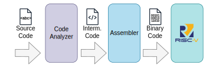
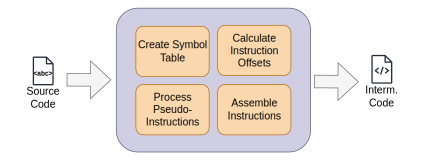
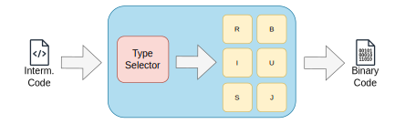
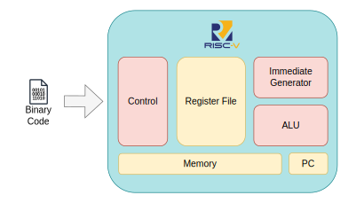
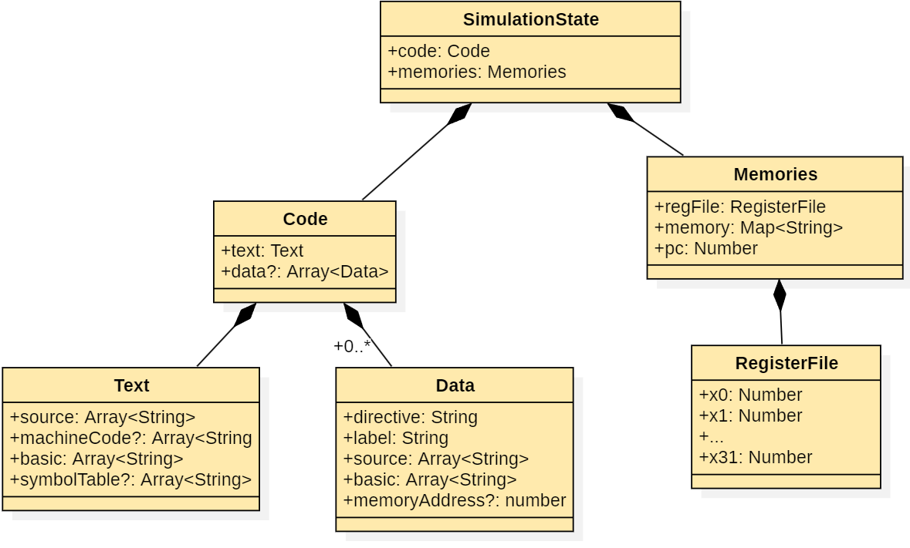

O **ÆRIS** é um simulador web da arquitetura **RISC-V (RV32I)** projetado com uma arquitetura modular que separa a interface gráfica da lógica de simulação.

O sistema foi estruturado para dividir responsabilidades como:

- análise do código assembly
- montagem das instruções
- execução do programa
- atualização do estado da máquina simulada

Essa separação torna o simulador mais fácil de manter, entender e expandir.

De forma geral, o simulador é composto por dois grandes blocos:

- **Interface Gráfica** - responsável pela interação com o usuário
- **Núcleo de Simulação** - responsável por analisar, montar e executar o código RISC-V

A comunicação entre essas partes ocorre através de um objeto central de estado que mantém todas as informações da simulação atual.

---

# Arquitetura Geral

A arquitetura do **ÆRIS** segue uma organização inspirada em **Clean Architecture**, separando a lógica do simulador em diferentes camadas.

As principais camadas são:

- **Domain Layer** – contém a lógica principal do simulador e o modelo do processador
- **Application Layer** – define os casos de uso do sistema
- **Adapters Layer** – integra serviços externos e comunicação com a interface
- **Interface Layer** – componentes Angular responsáveis pela interface gráfica

Essa organização permite que o núcleo de simulação funcione independentemente da interface, facilitando manutenção e evolução do sistema.

---

# Núcleo de Simulação

O **núcleo de simulação** é responsável por processar e executar programas escritos em assembly RISC-V.

Ele é composto por três componentes principais:

- **Code Analyzer**
- **Assembler**
- **Processor**

Esses componentes trabalham em sequência para transformar o código assembly em instruções executáveis e simular sua execução.

 

---

## Code Analyzer

O **Code Analyzer** interpreta o código assembly escrito pelo usuário e prepara as informações necessárias para o processo de montagem.

Entre suas responsabilidades estão:

- separar o código em linhas e instruções
- identificar os segmentos `.text` e `.data`
- expandir pseudo-instruções
- resolver rótulos (labels)
- construir a tabela de símbolos

O resultado desse processo é uma representação intermediária do programa que será utilizada pelo assembler.

 

---

## Assembler

O **Assembler** converte a representação intermediária do programa em código de máquina RISC-V.

Cada instrução é analisada para identificar seu opcode e determinar seu formato na arquitetura RISC-V. O simulador suporta os formatos **R, I, S, B, U e J**, que definem a organização dos campos da instrução e como ela é codificada em código de máquina de 32 bits.

Com base nessas informações, o assembler gera a instrução correspondente em **código binário de 32 bits**, que será carregada na memória simulada.

 

---

## Processor

O **Processor** é responsável por executar as instruções geradas pelo assembler.

Ele simula os principais componentes de um processador RISC-V, incluindo:

- **Register File** - conjunto de registradores
- **Program Counter (PC)**
- **Memory**
- **ALU (Arithmetic Logic Unit)**
- **Control Unit**
- **Immediate Generator**

 

---

# Estado da Simulação

Todas as informações da execução são armazenadas em um objeto central chamado **SimulationState**.

Esse objeto mantém:

- código binário do programa
- dados do programa
- tabela de símbolos
- conteúdo da memória
- valores dos registradores
- valor atual do program counter

O **SimulationState** atua como ponte entre o núcleo de simulação e a interface gráfica, garantindo que qualquer alteração no estado do processador seja refletida em tempo real na interface.

---

# Interface Gráfica

A interface gráfica do simulador foi desenvolvida utilizando o framework **Angular**, seguindo uma arquitetura baseada em componentes.

O ambiente do simulador é organizado em diferentes painéis, cada um responsável por apresentar uma parte específica do estado da simulação:

- **Options Menu** - reúne as principais ações do simulador, como criar ou abrir arquivos, montar o código, controlar a execução do programa e acessar configurações ou ajuda
- **Editor Panel** - permite escrever e editar programas em assembly RISC-V
- **Execution Panel** - exibe o código montado e o conteúdo da memória durante a execução
- **Register Panel** - mostra o estado atual dos registradores do processador
- **Console** - apresenta mensagens do sistema, saídas do programa e permite entrada de dados pelo usuário

Esses componentes interagem diretamente com o objeto central de estado da simulação, que mantém as informações atualizadas sobre registradores, memória, instruções executadas e demais elementos do processador simulado.

