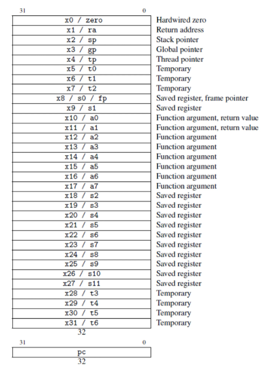
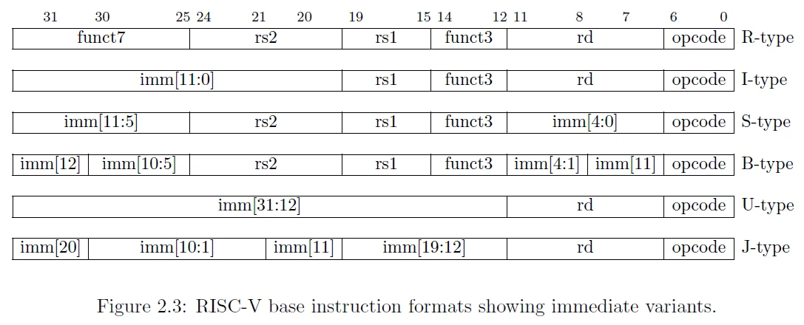

O RISC-V é uma Arquitetura de Conjunto de Instruções (ISA) aberta baseada nos princípios de Reduced Instruction Set Computing (RISC)

Ela define como o software se comunica com o processador através de:

- instruções de máquina
- registradores
- memória

O **ÆRIS** implementa o conjunto **RV32I**, que é o conjunto base inteiro da arquitetura RISC-V e representa o ponto de partida mais comum para aprendizado da arquitetura

---

# RV32I

O simulador implementa **RV32I**, o conjunto base inteiro da arquitetura RISC-V

| Propriedade | Valor |
|-------------|------|
| Tamanho da palavra | 32 bits |
| Largura dos registradores | 32 bits |
| Número de registradores | 32 |
| Tamanho das instruções | 32 bits |
| Conjunto de instruções | Base inteira |

O conjunto RV32I inclui instruções para:

- operações aritméticas
- acesso à memória
- desvios condicionais
- saltos
- chamadas de sistema

---

# Registradores

O RISC-V define **32 registradores de propósito geral**:

    x0 - x31

Cada registrador armazena um valor de **32 bits**

## Convenção ABI

Além do nome numérico, muitos registradores possuem **nomes ABI**, que indicam seu uso convencional

| Registrador | Nome ABI | Uso típico |
|-------------|---------|-----------|
| x0 | zero | constante zero |
| x1 | ra | endereço de retorno |
| x2 | sp | ponteiro da pilha |
| x3 | gp | ponteiro global |
| x4 | tp | ponteiro de thread |
| x5–x7 | t0–t2 | temporários |
| x8–x9 | s0–s1 | registradores salvos |
| x10–x17 | a0–a7 | argumentos de função |
| x18–x27 | s2–s11 | registradores salvos |
| x28–x31 | t3–t6 | temporários |

---

# Formatos de Instrução

Todas as instruções RV32I possuem **32 bits**, mas a organização interna desses bits depende do **formato da instrução**

Os principais formatos são:

| Formato | Finalidade |
|--------|------------|
| R-type | operações entre registradores |
| I-type | operações com imediato e loads |
| S-type | stores |
| B-type | desvios condicionais |
| U-type | imediato superior |
| J-type | saltos |

Cada formato posiciona os campos da instrução em diferentes posições dentro da palavra de 32 bits

Campos comuns incluem:

- opcode
- registradores fonte
- registrador destino
- imediato

---

# Program Counter

O **Program Counter (PC)** armazena o endereço da instrução atual

Normalmente:
PC = PC + 4

Isso ocorre porque cada instrução ocupa 4 bytes.

Instruções de **branch** e **jump** modificam o valor do PC para alterar o fluxo de execução do programa

---

# Chamadas de Sistema

A instrução `ecall` permite que o programa solicite serviços ao ambiente de execução

No **ÆRIS**, as syscalls são utilizadas para interagir com o console

Exemplo:

    li a7, 1
    li a0, 42
    ecall

Esse código imprime o inteiro armazenado em `a0`