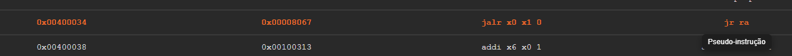

Pseudo-instruções são atalhos sintáticos que facilitam a escrita e leitura de programas em Assembly. Elas não fazem parte do hardware do RISC-V.

Durante o processo de montagem, cada pseudo-instrução é expandida automaticamente para uma ou mais instruções reais do conjunto **RV32I**.

No simulador **ÆRIS**, essa expansão ocorre durante a fase de análise do código, através do componente `PseudoExpander`. Após a expansão, apenas instruções reais permanecem no programa antes da geração do código de máquina.

---

## Identificação Visual no Simulador

No **Text Segment**, as linhas que se originaram de uma pseudo-instrução são exibidas na cor **laranja**.

Ao passar o mouse sobre uma dessas linhas, um tooltip indica que a instrução se trata de uma pseudo-instrução.

# Pseudo Instruções de Movimento

| Pseudo       | Descrição                                  |
| ------------ | ------------------------------------------ |
| `mv rd, rs`  | Copia o valor de um registrador para outro |
| `nop`        | Não executa nenhuma operação               |
| `not rd, rs` | Inverte todos os bits de um registrador    |

---

# Pseudo Instruções de Imediato

| Pseudo       | Descrição                                |
| ------------ | ---------------------------------------- |
| `li rd, imm` | Carrega um valor imediato no registrador |

---

# Pseudo Instruções de Endereço

| Pseudo         | Descrição                      |
| -------------- | ------------------------------ |
| `la rd, label` | Carrega o endereço de um label |

---

# Pseudo Instruções de Salto

| Pseudo             | Descrição                                      |
| ------------------ | ---------------------------------------------- |
| `j label`          | Salto incondicional                            |
| `jal label`        | Salta e salva endereço de retorno em `ra`      |
| `jalr rs`          | Salta para endereço em registrador             |
| `jalr rs, imm`     | Salta para endereço `rs + imm`                 |
| `jalr rd, imm(rs)` | Salta para `rs + imm` salvando retorno em `rd` |
| `jr rs`            | Salta para endereço armazenado em `rs`         |
| `jr rs, imm`       | Salta para endereço `rs + imm`                 |

---

# Pseudo Instruções de Branch

| Pseudo                 | Descrição              |
| ---------------------- | ---------------------- |
| `beqz rs, label`       | Desvia se `rs == 0`    |
| `bnez rs, label`       | Desvia se `rs != 0`    |
| `bgez rs, label`       | Desvia se `rs >= 0`    |
| `bltz rs, label`       | Desvia se `rs < 0`     |
| `bgtz rs, label`       | Desvia se `rs > 0`     |
| `blez rs, label`       | Desvia se `rs <= 0`    |
| `bgt rs1, rs2, label`  | Desvia se `rs1 > rs2`  |
| `bgtu rs1, rs2, label` | Desvia (unsigned)      |
| `ble rs1, rs2, label`  | Desvia se `rs1 <= rs2` |
| `bleu rs1, rs2, label` | Desvia (unsigned)      |

---

# Pseudo Instruções de Load

| Pseudo             | Descrição                                    |
| ------------------ | -------------------------------------------- |
| `lb rd, (rs)`      | Carrega byte da memória                      |
| `lb rd, imm`       | Carrega byte usando offset                   |
| `lb rd, largeImm`  | Carrega byte com imediato grande             |
| `lb rd, label`     | Carrega byte a partir de um label            |
| `lbu rd, (rs)`     | Carrega byte sem sinal                       |
| `lbu rd, imm`      | Carrega byte sem sinal com offset            |
| `lbu rd, largeImm` | Carrega byte sem sinal com offset grande     |
| `lbu rd, label`    | Carrega byte sem sinal de label              |
| `lh rd, (rs)`      | Carrega halfword                             |
| `lh rd, imm`       | Carrega halfword com offset                  |
| `lh rd, largeImm`  | Carrega halfword com offset grande           |
| `lh rd, label`     | Carrega halfword de label                    |
| `lhu rd, (rs)`     | Carrega halfword sem sinal                   |
| `lhu rd, imm`      | Carrega halfword sem sinal com offset        |
| `lhu rd, largeImm` | Carrega halfword sem sinal com offset grande |
| `lhu rd, label`    | Carrega halfword sem sinal de label          |
| `lw rd, (rs)`      | Carrega word da memória                      |
| `lw rd, imm`       | Carrega word com offset                      |
| `lw rd, largeImm`  | Carrega word com offset grande               |
| `lw rd, label`     | Carrega word de label                        |

---

# Pseudo Instruções de Store

| Pseudo             | Descrição                    |
| ------------------ | ---------------------------- |
| `sb rs, (rd)`      | Armazena byte na memória     |
| `sb rs, imm`       | Armazena byte com offset     |
| `sb rs, label, rt` | Armazena byte em label       |
| `sh rs, (rd)`      | Armazena halfword            |
| `sh rs, imm`       | Armazena halfword com offset |
| `sh rs, label, rt` | Armazena halfword em label   |
| `sw rs, (rd)`      | Armazena word                |
| `sw rs, imm`       | Armazena word com offset     |
| `sw rs, label, rt` | Armazena word em label       |

---

# Pseudo Instruções de Set

| Pseudo              | Descrição                          |
| ------------------- | ---------------------------------- |
| `seqz rd, rs`       | `rd = 1` se `rs == 0`              |
| `snez rd, rs`       | `rd = 1` se `rs != 0`              |
| `sltz rd, rs`       | `rd = 1` se `rs < 0`               |
| `sgtz rd, rs`       | `rd = 1` se `rs > 0`               |
| `sgt rd, rs1, rs2`  | `rd = 1` se `rs1 > rs2`            |
| `sgtu rd, rs1, rs2` | `rd = 1` se `rs1 > rs2` (unsigned) |
