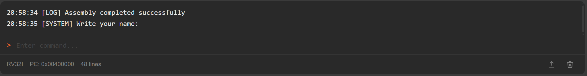
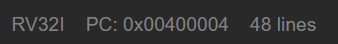
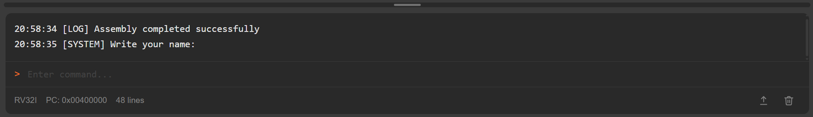

O **console** é responsável por exibir mensagens geradas pelo simulador e pelos programas executados. Ele funciona como uma interface de comunicação entre o usuário e o ambiente de simulação.

Durante o uso do simulador, o console pode apresentar diferentes tipos de informações, incluindo:

- mensagens de erro
- resultados do processo de montagem do código
- informações sobre operações realizadas no simulador
- saída produzida por programas em execução
- notificações sobre operações com arquivos, como importação e download de programas

Além de exibir mensagens, o console também permite **entrada de dados pelo usuário**, possibilitando interação com programas que utilizam chamadas de sistema (*syscalls*).

---

## Entrada de Dados

Quando uma chamada de sistema que requer entrada de dados é executada, o console apresenta um **campo de entrada**, permitindo que o usuário forneça o valor solicitado.

Esse mecanismo permite que programas solicitem dados ao usuário durante a execução, como leitura de números ou strings.

---

## Informações do Console

Na parte inferior do console existe uma barra com informações sobre o estado atual da execução.

Nessa área são exibidas:

- **PC atual** - mostra o valor atual do *Program Counter*
- **Quantidade de linhas** - indica o número de linhas atualmente exibidas no console

---

## Ações do Console

No lado direito da barra inferior existem dois botões responsáveis por operações relacionadas ao conteúdo do console.

As ações disponíveis são:

- **Export Console** - Exporta todo o conteúdo do console para um arquivo de texto

- **Clear Console** - Remove todas as mensagens atualmente exibidas no console

---

## Ajuste do Tamanho do Console

Acima do console existe uma **barra de redimensionamento** que permite ajustar o espaço ocupado pelo console na interface.

Essa barra pode ser arrastada verticalmente para aumentar ou reduzir o tamanho do console, permitindo adaptar a visualização conforme a necessidade do usuário.

