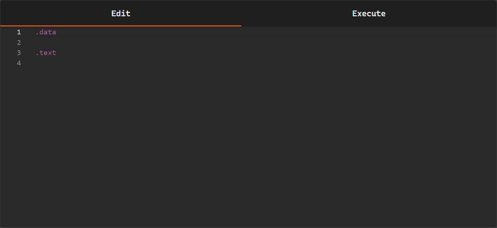

## Painel de Edição

O **painel de edição** é a área principal onde os programas em linguagem de montagem RISC-V são escritos e modificados.

Essa área funciona como um editor de código, permitindo que o usuário escreva diretamente as instruções e dados que compõem o programa. O editor foi projetado para centralizar a escrita do código e facilitar a preparação do programa para o processo de montagem e execução.

Dentro do editor, o programa normalmente é organizado em segmentos:

- `.text`
- `.data`

Esses segmentos indicam ao simulador como o conteúdo do programa deve ser interpretado.

---

## Segmento `.text`

O segmento **`.text`** é utilizado para escrever as instruções executáveis do programa.

Exemplo:

    .text
    addi t0, zero, 5
    addi t1, zero, 10
    add t2, t0, t1

Durante o processo de montagem, as instruções presentes nesse segmento são convertidas para código de máquina. 

---

## Segmento `.data`

O segmento **`.data`** é utilizado para declarar dados estáticos que serão utilizados pelo programa.

Exemplo:

    .data
    value: .word 10

Esses dados podem posteriormente ser acessados pelas instruções presentes no segmento `.text`.

---

## Uso dos Segmentos

O uso dos segmentos `.text` e `.data` segue algumas regras importantes no simulador:

- Um programa pode possuir apenas o segmento `.text` caso não seja necessário declarar dados
- Um programa não deve possuir apenas o segmento `.data` pois nesse caso não existiriam instruções executáveis
- Caso instruções sejam escritas após o segmento `.data`, o simulador interpretará esse conteúdo como parte da seção de dados, o que resultará em um erro exibido no console durante o processo de montagem
- Também é possível escrever código sem declarar explicitamente `.text` ou `.data` porém nesse caso o programa não possuirá separação entre dados e instruções

Exemplo comum de estrutura:

    .data
    # declarações de dados

    .text
    # instruções do programa

## Escrita de Código

O editor do simulador possui recursos que auxiliam na escrita de programas em assembly RISC-V.

Durante a digitação, o editor oferece autocompletar para alguns elementos da linguagem, facilitando a escrita do código e reduzindo erros de digitação.

Entre os elementos suportados pelo autocompletar estão:

- instruções da arquitetura RISC-V
- registradores

Quando o usuário começa a digitar uma instrução ou registrador, o editor apresenta uma lista de sugestões que podem ser selecionadas diretamente no teclado ou com o mouse.

Esse recurso ajuda a:

- escrever código de forma mais rápida
- evitar erros de digitação em instruções e registradores
- facilitar o aprendizado da sintaxe da linguagem