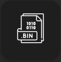
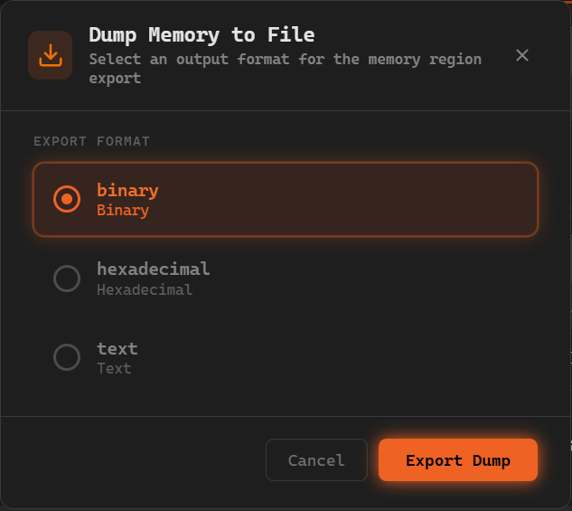
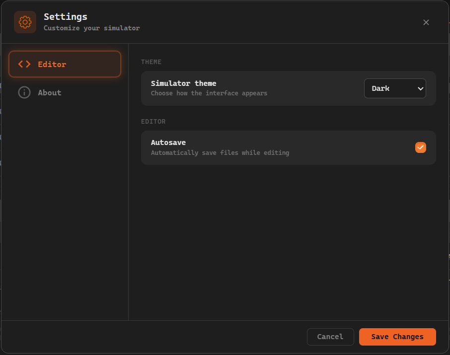
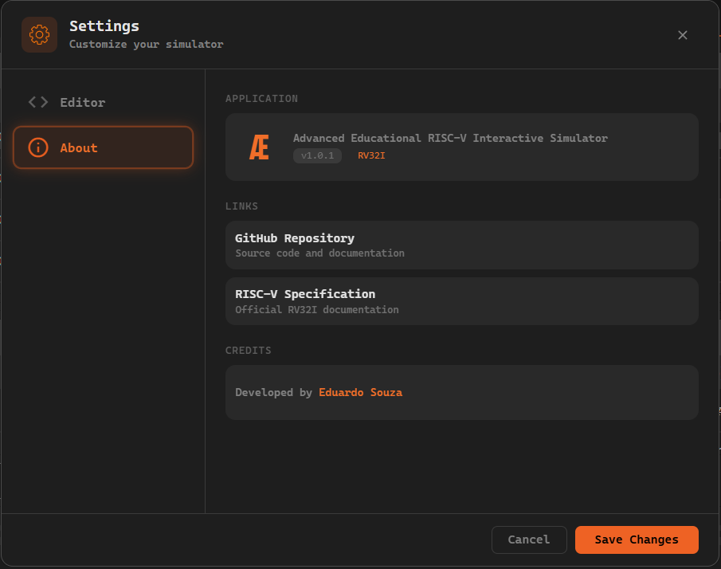
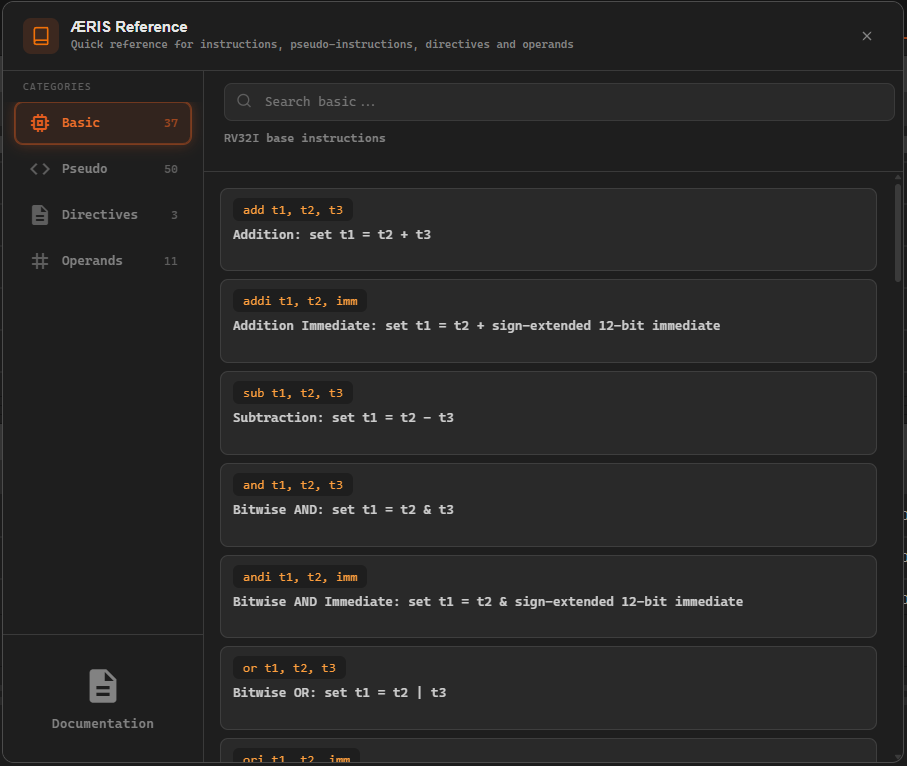

O menu de opções concentra as principais ações relacionadas ao fluxo de uso do simulador. É por meio dele que o usuário acessa os recursos de manipulação de arquivos, montagem do código, controle de execução do programa, configurações gerais e ajuda.

Essa área funciona como o ponto central de interação para iniciar, preparar e controlar a execução de programas no **ÆRIS**.


De forma geral, o menu pode ser dividido em quatro grupos principais de funcionalidades:

1. operações de arquivo
2. exportação do programa montado
3. controles de montagem e execução
4. opções gerais e ajuda

---

## Operações de Arquivo

As operações de arquivo permitem iniciar um novo código, abrir arquivos existentes e salvar o conteúdo atual do editor.

### Novo arquivo

A opção **Novo arquivo** cria um novo arquivo no editor utilizando a estrutura padrão de um programa.


Ao utilizar essa ação, o conteúdo atualmente presente no editor é substituído pelo template inicial do simulador:

```
.data

.text
```


Essa funcionalidade é útil quando o usuário deseja:

- iniciar um novo programa a partir da estrutura básica
- limpar rapidamente o conteúdo atual do editor
- reiniciar a escrita do código sem precisar reconstruir manualmente os segmentos principais

Como essa ação substitui o conteúdo atual do editor, ela deve ser utilizada com atenção caso existam alterações ainda não salvas.

---

### Abrir arquivo

A opção **Abrir arquivo** permite carregar, a partir do computador do usuário, um arquivo de linguagem de montagem com extensão `.asm`.


Ao selecionar um arquivo válido, o conteúdo é carregado no editor, permitindo sua visualização, edição, montagem e execução dentro do simulador.

Esse recurso é útil para:

- continuar trabalhando em programas previamente salvos
- testar exemplos externos
- carregar exercícios, demonstrações ou códigos de apoio
- reutilizar arquivos desenvolvidos fora do ambiente do simulador

O arquivo carregado passa a ocupar o conteúdo atual do editor.

---

### Baixar arquivo atual

A opção **Baixar arquivo atual** realiza o download do código atualmente presente no editor com extensão `.asm`.


Essa funcionalidade permite salvar localmente o conteúdo que está sendo editado no simulador, preservando o programa para uso posterior.

Ela pode ser utilizada para:

- armazenar cópias do código no computador
- compartilhar programas com outras pessoas
- criar versões intermediárias de desenvolvimento
- manter backup do trabalho realizado no editor

Esse recurso é especialmente importante quando o usuário deseja continuar o desenvolvimento posteriormente ou utilizar o mesmo programa em outros ambientes.

---

## Exportação do Programa Montado

Além de salvar o código-fonte em linguagem de montagem, o **ÆRIS** também permite exportar o programa já montado em diferentes formatos.

### Dump do programa

O **Dump do programa** permite exportar o resultado da montagem do código em diferentes formatos.

O acesso a essa funcionalidade é feito por meio do **botão de Dump**, localizado no menu do simulador.



Esse botão só fica **habilitado após a montagem do programa** ser realizada com sucesso. Caso o código ainda não tenha sido montado, ou existam erros na montagem, o botão permanece desativado.

Ao clicar no botão de dump, o simulador abre um **modal de exportação**, onde é possível escolher o formato em que o programa montado será exportado.



Dentro desse modal estão disponíveis os seguintes formatos de exportação:

- **Binary** exporta o programa em formato binário (`.bin`), contendo a representação direta das instruções em código de máquina

- **Hexadecimal** exporta o programa em formato hexadecimal (`.hex`), onde cada instrução é representada em base hexadecimal

- **Text** exporta uma representação textual (`.txt`) contendo as instruções montadas e a memória utilizada pelo programa

Essa funcionalidade é útil quando se deseja:

- inspecionar o resultado da montagem fora do simulador
- comparar diferentes representações do programa
- utilizar o código montado em outros ambientes ou ferramentas
- registrar o resultado da montagem para análise ou documentação

É importante observar que o **dump não exporta apenas o texto escrito no editor**, mas sim o resultado produzido após o processo de montagem. Ou seja, o conteúdo exportado corresponde à versão já processada do programa, pronta para execução.

---

## Montagem e Execução

Ao lado das opções de arquivo ficam os controles responsáveis por transformar o código-fonte em instruções executáveis e controlar a simulação do programa. Esses controles são utilizados depois que o código já foi escrito ou carregado no editor.

### Montar

A opção **Montar** analisa o código escrito no editor e o converte para código de máquina.


Durante esse processo, o simulador interpreta a estrutura do programa, processa instruções, diretivas e demais elementos suportados, e prepara o conteúdo para execução.

A montagem é uma etapa obrigatória antes da execução do programa. Enquanto o código não for montado corretamente, os controles de execução não ficam disponíveis.

Essa etapa é importante porque:

- valida o conteúdo escrito no editor
- prepara o programa para simulação
- gera a representação montada que será exibida no painel de execução
- permite identificar problemas antes da execução

---

### Executar continuamente

A opção **Executar continuamente** inicia a execução automática do programa.


Nesse modo, o simulador avança sucessivamente pelas instruções sem exigir interação do usuário a cada passo.

A execução continua até que o programa termine ou até que uma instrução `ecall` que requer entrada de dados seja executada. Nesses casos, a execução é pausada para que o usuário possa fornecer o valor solicitado no console.

Esse tipo de execução é útil quando se deseja:

- observar rapidamente o comportamento geral do programa
- testar o resultado final da execução
- verificar a saída produzida no console
- executar programas simples sem inspecionar cada instrução individualmente

---

### Execução passo a passo

A opção **Execução passo a passo** executa uma instrução por vez.


Esse modo é especialmente importante para análise detalhada do comportamento do programa, pois permite acompanhar com precisão o efeito de cada instrução sobre o estado do processador.

O botão **Execução passo a passo** só fica disponível quando ainda existem instruções a serem executadas. Caso a execução já tenha alcançado a última instrução do programa, o botão é desabilitado.

A execução passo a passo é útil para:

- estudar o fluxo de execução de um programa
- entender como cada instrução altera registradores e memória
- depurar comportamentos inesperados
- observar saltos, operações aritméticas, acessos à memória e chamadas de sistema de forma controlada

---

### Desfazer último passo

A opção **Desfazer último passo** retorna ao estado anterior da execução.


Esse recurso permite reverter a última instrução executada, possibilitando revisar transições de estado sem a necessidade de reiniciar toda a simulação.

O botão **Desfazer último passo** só fica habilitado depois que pelo menos uma instrução foi executada. Se nenhuma instrução tiver sido executada ainda, a opção permanece desabilitada.

Ele é útil para:

- revisar alterações causadas por uma instrução específica
- comparar o estado antes e depois de um passo
- voltar rapidamente em análises feitas no modo passo a passo
- corrigir avanços feitos acidentalmente

Essa funcionalidade melhora significativamente a experiência de exploração e depuração do programa.

---

### Resetar execução

A opção **Resetar execução** reinicia o estado do simulador, permitindo executar novamente o programa desde o início.


Ao resetar, o simulador retorna a execução para seu estado inicial após a montagem, descartando o progresso realizado durante a simulação atual.

Esse recurso é útil quando o usuário deseja:

- reiniciar completamente o teste do programa
- repetir uma execução desde o início
- comparar diferentes estratégias de execução
- reavaliar o comportamento do código após mudanças

O reset é especialmente útil após várias etapas de teste ou exploração no modo passo a passo.

---

## Modal de Opções

Além dos recursos de arquivo e execução, o menu também fornece acesso às configurações gerais do ambiente.

O botão **Opções** abre o modal de configuração do simulador.


Ao clicar nesse botão, é exibido um modal onde é possível ajustar configurações relacionadas ao comportamento e à aparência da interface.



Dentro desse modal estão disponíveis algumas configurações do simulador.

Entre elas estão:

- **Tema da interface**  
  Permite selecionar o tema visual do simulador.  
  Atualmente, apenas o tema *dark* está disponível.

- **Autosave do editor**  
  Permite habilitar ou desabilitar o salvamento automático do conteúdo do editor.  
  Quando essa opção está ativa, o código escrito no editor é preservado automaticamente e pode ser restaurado caso a página seja recarregada.

Na parte inferior do modal existem dois botões de controle:

- **Cancelar** fecha o modal descartando as alterações realizadas
- **Salvar** aplica as configurações selecionadas

#### Aba About

O modal também possui uma aba chamada **About**, que apresenta informações sobre o projeto.



Nessa aba são exibidas informações institucionais e de referência, incluindo:

- a versão atual do **ÆRIS**
- o link para o repositório do projeto
- o link para a especificação oficial do RISC-V

Essa seção permite consultar rapidamente informações sobre o simulador e acessar recursos externos relacionados ao projeto.

---

## Modal de Ajuda

O botão **Ajuda** abre o modal de ajuda do simulador.


Ao clicar nesse botão, é exibido um modal contendo uma referência rápida dos principais elementos suportados pelo simulador.



Esse modal organiza as informações em diferentes abas, permitindo navegar facilmente pelos tipos de elementos aceitos pelo simulador.

As abas disponíveis são:

- **Instruções (Basic)** lista as instruções básicas suportadas pelo simulador
- **Pseudo-instruções (Pseudo)** apresenta as pseudo-instruções disponíveis
- **Diretivas (Directives)** mostra as diretivas aceitas pelo assembler
- **Operadores (Operands)** exibe os operadores utilizados nas instruções

Cada aba possui uma **barra de busca** localizada na parte superior do modal.  
Essa busca permite filtrar rapidamente os elementos exibidos, facilitando encontrar uma instrução, diretiva ou operador específico.

Essas informações ajudam o usuário a entender rapidamente o que cada elemento faz e como ele pode ser utilizado durante a escrita de programas no editor.

Na parte inferior do modal também existe um link direto para esta documentação, permitindo acessar explicações mais completas sobre o simulador e seus recursos.