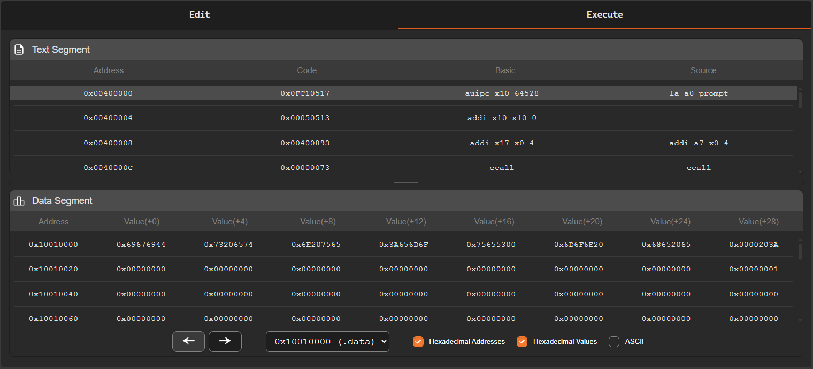
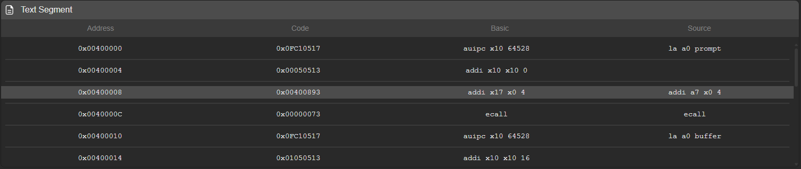
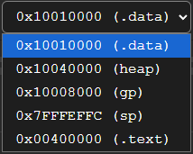
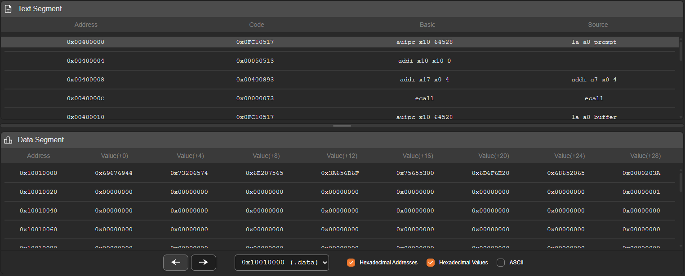

The **execution panel** is responsible for displaying the result of the program assembly process and the current state of memory during execution.

This panel is divided into two main areas:

- **Text Segment**
- **Data Segment**

Each of these areas presents different information about the program state during simulation.

---

## Text Segment

The **text segment** displays the program instructions after the assembly process.

For each instruction, the simulator shows its memory address, the machine code in hexadecimal format, and the corresponding assembly instruction. When the user writes pseudo-instructions, the simulator also displays the real instructions generated during the assembly process.

Example:

    0x00400000    0x0FC10517    auipc x10 64528    la a0 prompt
    0x00400004    0x00050513    addi x10 x10 0

In this example, the pseudo-instruction:

    la a0 prompt

is converted by the assembler into **two real instructions**:

    auipc
    addi

This happens because some pseudo-instructions in assembly represent sequences of real instructions from the architecture.

### Current Instruction

During program execution, the simulator highlights with **a different color** the instruction that will be executed next.

This highlight follows the value of the **Program Counter (PC)** and allows the execution flow of the program to be easily visualized.

If a jump instruction (*jump* or *branch*) occurs, the highlight moves directly to the destination instruction, indicating the new position of the execution flow.

---

## Data Segment

The **data segment** displays the contents of the simulator memory.

Since the system memory is very large, the panel provides tools to facilitate navigation between different memory regions.

### Memory Region Selection

At the top of the panel there is a **memory region selector**, which allows direct navigation to important parts of the program memory.

The available regions are:

- `.data` - `0x10010000`
- `heap` - `0x10040000`
- `gp` - `0x10008000`
- `sp` - `0x7fffeffc`
- `.text` - `0x00400000`

Each option automatically moves the memory view to the **starting address of the selected region**.

This navigation allows quick access to the most relevant areas of memory without manually traversing the entire address space.

---

## Memory Visualization

Next to the memory selector there are **three display options** that control how data is shown:

- **Hex Address** - Displays memory addresses in hexadecimal format

- **Hex Value** - Displays the values stored in memory in hexadecimal format

- **ASCII** - Displays memory values interpreted as ASCII characters

When **ASCII** visualization is enabled, it replaces the hexadecimal value display, showing the memory contents as characters.

Each memory word is converted to ASCII by interpreting its bytes individually.

---

## Memory Pagination

Memory is displayed in **pages**, where each page contains:

- **128 memory addresses**

This allows memory to be browsed in an organized way and prevents displaying an excessive amount of data at once.

---

## Panel Size Adjustment

Between the **text segment** and the **data segment** there is a **resizing bar**.

This bar can be dragged vertically to adjust the visible space between the *text segment* and the *data segment*.

This feature allows the visualization to be adjusted according to the user's needs, making it easier to analyze instructions or inspect memory contents.

