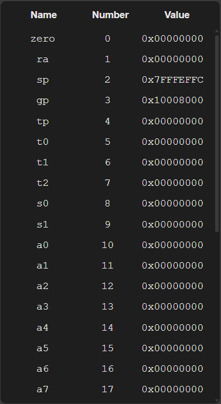
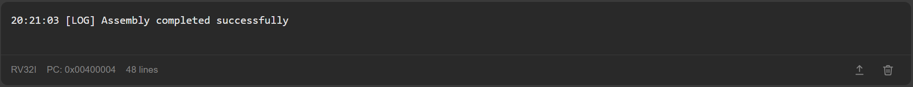
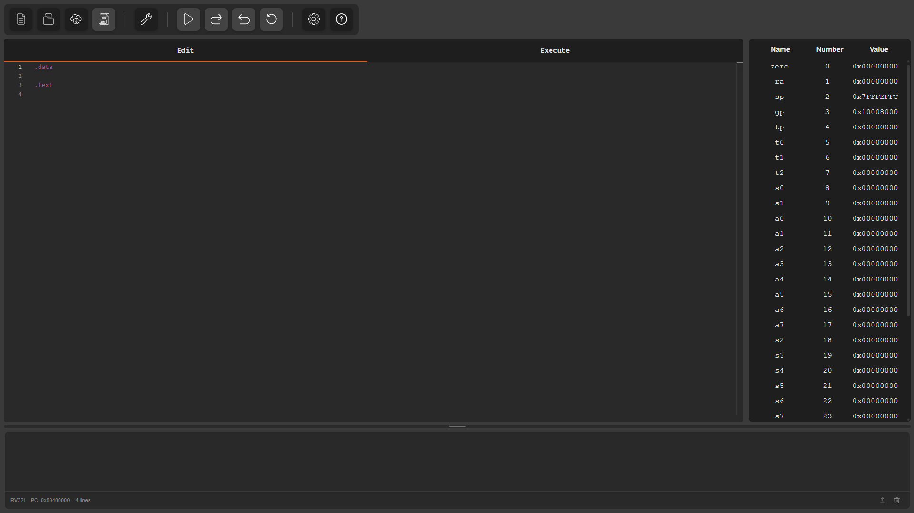

**ÆRIS** provides an interactive environment for writing, assembling, and executing RISC-V assembly programs directly in the browser. The simulator interface was designed to make it easier to observe how a program behaves at the instruction level.

This guide explains how to use the simulator and how each part of the interface contributes to the execution flow of a program.

## Basic Workflow

Using **ÆRIS** usually follows a simple sequence:

1. **Write or load a program** in the editor
2. **Assemble the code**, which performs analysis and converts it into machine instructions
3. **Execute the program**, either step by step or continuously
4. **Inspect the program state** through registers, memory, and console output

During execution, the simulator updates the processor state after each instruction, allowing you to observe how values move between registers and memory.

## Main Interface Areas

The simulator interface is divided into different areas, each responsible for a part of the program editing, execution, and analysis process.

### Options Menu

The options menu gathers the main actions related to program editing, code assembly, and execution control. From it, it is possible to create or open files, assemble the program, start or control execution, and access simulator options and help.

---

### Editor

The editor is the main area where assembly programs are written or loaded.

In it, it is possible to edit the program code, organize the `.text` and `.data` segments, and prepare the code for assembly and execution.

---

### Register View

This area displays the current values of the 32 RISC-V registers, as well as the program counter at the end.

During program execution, it is possible to follow how the register values are modified by the executed instructions.

---

### Execution Panel

The execution panel displays the assembled code and the current state of program execution.

The upper part of the panel shows the `.text` segment, where the program instructions are displayed after being converted to machine code. During execution, it is possible to observe which instruction is being executed and follow the program flow.

The lower part allows navigation through the processor memory, showing the data used by the program during execution.

Among the available features are:

- memory page navigation
- each page displaying **128 addresses**
- visualization of **addresses** in **hexadecimal** or **decimal** format
- visualization of **memory values** in **hexadecimal**, **decimal**, or **ASCII** format

Between the two areas there is a resize bar, which can be dragged up or down to adjust the visible space of each part of the panel and make it easier to view the instructions or memory.

### Console

The console displays messages generated by the simulator and also the outputs produced by the program during execution.

It functions as the program's standard input and output device inside the simulator and is used for interaction through system calls (`ecall`).

Depending on the type of call executed, the console may display messages, print values, or request data from the user. When a system call that requires input data is executed, the console presents an input field, allowing the user to type the requested value. After entering the value, the program continues its execution normally.

At the bottom of the console, auxiliary information is also displayed, such as:

- the current program counter (PC)
- the number of lines displayed in the console

On the right side of the panel there are two additional buttons:

- **Export console**  
  Allows exporting the entire current console content to a file

- **Clear console**  
  Removes all messages currently displayed in the console

In addition to the program interactions, the console also displays messages related to the simulator operation, such as code assembly results and other important information during execution.

---

## Complete Simulator Interface

The image below presents an overview of the complete **ÆRIS** interface and the position of each of the areas described above.

## What you will learn in this guide

The following pages of the **User Guide** are organized into tabs, and each one explains a specific part of the simulator and how to use it.

In this guide you will learn how to:

- Navigate through the simulator interface
- Use the options menu to create, open, assemble, and execute programs
- Understand which instructions, directives, operators, and pseudo-instructions are supported by the editor for writing programs
- How to check which instructions, directives, operators, and pseudo-instructions are supported by the simulator through Help
- Inspect the program state through the registers
- Explore and analyze the processor memory content
- Use the console to view program outputs and interact through system calls (`ecall`)
- Configure the simulator options

By the end of this guide, you should be comfortable using **ÆRIS** to experiment with RV32I assembly programs and observe how they execute step by step.