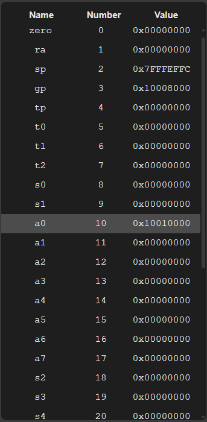

The **register panel** displays the current state of the RISC-V processor registers during program execution.

This panel presents all 32 registers of the architecture, as well as the **Program Counter (PC)**, which is displayed at the end of the list.

Each row in the panel shows the register name, its architectural number, and the value currently stored in it.

This information is automatically updated as the program executes, allowing the user to monitor how instructions modify the internal state of the processor.

---

## Highlighting Changes

Whenever the value of a register is modified during execution, the simulator applies a different background color to the corresponding row.

This visual highlight makes it easier to identify changes caused by executed instructions, allowing users to quickly see which registers were affected.

The panel also automatically scrolls to the modified register, ensuring that the change is visible even when it occurs outside the currently visible area.